# 🗂️ MediPlant Database ER Diagram

## Entity Relationship Diagram - MediPlant E-Commerce Platform

```mermaid
erDiagram
    %% Core User Management
    ROLES {
        int id PK
        enum name "admin, supplier, consumer"
        varchar description
        timestamp created_at
    }
    
    USERS {
        int id PK
        varchar name
        varchar email UK
        varchar password_hash
        varchar phone
        int role_id FK
        boolean is_active
        boolean is_verified
        varchar profile_image
        timestamp date_joined
        timestamp last_login
    }
    
    SUPPLIER_PROFILES {
        int id PK
        int user_id FK,UK
        varchar business_name
        varchar business_license
        varchar tax_number
        text description
        varchar website
        text address
        varchar city
        varchar state
        varchar postal_code
        varchar country
        boolean is_approved
        timestamp approval_date
        decimal rating
        decimal total_sales
        decimal commission_rate
        timestamp created_at
    }
    
    USER_ADDRESSES {
        int id PK
        int user_id FK
        enum address_type "home, work, other"
        varchar full_name
        varchar phone
        varchar address_line1
        varchar address_line2
        varchar city
        varchar state
        varchar postal_code
        varchar country
        boolean is_default
        timestamp created_at
    }
    
    EMAIL_VERIFICATIONS {
        int id PK
        int user_id FK
        varchar token
        datetime expires_at
        boolean is_used
        timestamp created_at
    }
    
    PASSWORD_RESETS {
        int id PK
        int user_id FK
        varchar token
        datetime expires_at
        boolean is_used
        timestamp created_at
    }
    
    %% Product Catalog
    CATEGORIES {
        int id PK
        varchar name UK
        varchar slug UK
        text description
        int parent_id FK
        varchar image_url
        boolean is_active
        int sort_order
        timestamp created_at
    }
    
    PRODUCTS {
        int id PK
        varchar name
        varchar slug UK
        varchar scientific_name
        int category_id FK
        int supplier_id FK
        varchar sku UK
        text description
        varchar short_description
        text benefits
        text usage_instructions
        text care_instructions
        text warnings
        decimal base_price
        decimal discount_price
        int stock_quantity
        int min_order_quantity
        int max_order_quantity
        decimal weight
        varchar dimensions
        boolean is_active
        boolean is_featured
        varchar meta_title
        varchar meta_description
        int views_count
        int sales_count
        decimal rating_average
        int rating_count
        timestamp created_at
        timestamp updated_at
    }
    
    PRODUCT_IMAGES {
        int id PK
        int product_id FK
        varchar image_url
        varchar alt_text
        boolean is_primary
        int sort_order
        timestamp created_at
    }
    
    PRODUCT_VARIANTS {
        int id PK
        int product_id FK
        varchar name
        varchar sku UK
        decimal price
        decimal discount_price
        int stock_quantity
        decimal weight
        boolean is_active
        timestamp created_at
    }
    
    PRODUCT_ATTRIBUTES {
        int id PK
        int product_id FK
        varchar attribute_name
        varchar attribute_value
    }
    
    %% Shopping & Orders
    SHOPPING_CART {
        int id PK
        int user_id FK
        int product_id FK
        int variant_id FK
        int quantity
        timestamp created_at
        timestamp updated_at
    }
    
    WISHLISTS {
        int id PK
        int user_id FK
        int product_id FK
        timestamp created_at
    }
    
    COUPONS {
        int id PK
        varchar code UK
        varchar name
        text description
        enum discount_type "percentage, fixed"
        decimal discount_value
        decimal minimum_amount
        decimal maximum_discount
        int usage_limit
        int used_count
        boolean is_active
        datetime valid_from
        datetime valid_until
        int created_by FK
        timestamp created_at
    }
    
    ORDERS {
        int id PK
        varchar order_number UK
        int user_id FK
        int supplier_id FK
        enum status "pending, confirmed, processing, shipped, delivered, cancelled, refunded"
        enum payment_status "pending, paid, failed, refunded"
        enum payment_method "razorpay, paypal, stripe, cod"
        varchar payment_id
        decimal subtotal
        decimal tax_amount
        decimal shipping_amount
        decimal discount_amount
        decimal total_amount
        int coupon_id FK
        varchar coupon_code
        json shipping_address
        json billing_address
        varchar tracking_number
        timestamp shipped_at
        timestamp delivered_at
        text order_notes
        text admin_notes
        timestamp created_at
        timestamp updated_at
    }
    
    ORDER_ITEMS {
        int id PK
        int order_id FK
        int product_id FK
        int variant_id FK
        int quantity
        decimal unit_price
        decimal total_price
        varchar product_name
        varchar product_sku
        int supplier_id FK
    }
    
    ORDER_TRACKING {
        int id PK
        int order_id FK
        varchar status
        text message
        int updated_by FK
        timestamp created_at
    }
    
    %% Reviews & Ratings
    PRODUCT_REVIEWS {
        int id PK
        int product_id FK
        int user_id FK
        int order_id FK
        int rating "1-5"
        varchar title
        text comment
        boolean is_verified
        boolean is_approved
        int helpful_count
        timestamp created_at
        timestamp updated_at
    }
    
    REVIEW_HELPFULNESS {
        int id PK
        int review_id FK
        int user_id FK
        boolean is_helpful
        timestamp created_at
    }
    
    %% Communication
    CONTACT_MESSAGES {
        int id PK
        varchar name
        varchar email
        varchar phone
        varchar subject
        text message
        int user_id FK
        enum status "new, in_progress, resolved, closed"
        enum priority "low, medium, high, urgent"
        int assigned_to FK
        text admin_notes
        timestamp created_at
        timestamp updated_at
    }
    
    MESSAGES {
        int id PK
        int sender_id FK
        int recipient_id FK
        varchar subject
        text message
        boolean is_read
        enum message_type "general, order_inquiry, product_inquiry, support"
        int related_order_id FK
        int related_product_id FK
        timestamp created_at
    }
    
    %% Analytics
    PAGE_VIEWS {
        int id PK
        enum page_type "product, category, home, search"
        int page_id
        int user_id FK
        varchar ip_address
        text user_agent
        varchar referer
        varchar session_id
        timestamp created_at
    }
    
    SEARCH_QUERIES {
        int id PK
        varchar query
        int user_id FK
        int results_count
        varchar ip_address
        timestamp created_at
    }
    
    %% Notifications
    NOTIFICATIONS {
        int id PK
        int user_id FK
        varchar title
        text message
        enum notification_type "order, product, payment, system, promotion"
        boolean is_read
        varchar action_url
        timestamp created_at
    }
    
    %% System
    SITE_SETTINGS {
        int id PK
        varchar setting_key UK
        text setting_value
        enum setting_type "string, integer, decimal, boolean, json"
        text description
        boolean is_public
        int updated_by FK
        timestamp updated_at
    }
    
    AUDIT_LOGS {
        int id PK
        int user_id FK
        varchar action
        varchar table_name
        int record_id
        json old_values
        json new_values
        varchar ip_address
        text user_agent
        timestamp created_at
    }
    
    %% Relationships
    ROLES ||--o{ USERS : "has role"
    USERS ||--o| SUPPLIER_PROFILES : "has profile"
    USERS ||--o{ USER_ADDRESSES : "has addresses"
    USERS ||--o{ EMAIL_VERIFICATIONS : "has verifications"
    USERS ||--o{ PASSWORD_RESETS : "has resets"
    
    CATEGORIES ||--o{ CATEGORIES : "parent category"
    CATEGORIES ||--o{ PRODUCTS : "belongs to"
    USERS ||--o{ PRODUCTS : "supplies"
    
    PRODUCTS ||--o{ PRODUCT_IMAGES : "has images"
    PRODUCTS ||--o{ PRODUCT_VARIANTS : "has variants"
    PRODUCTS ||--o{ PRODUCT_ATTRIBUTES : "has attributes"
    
    USERS ||--o{ SHOPPING_CART : "owns cart"
    PRODUCTS ||--o{ SHOPPING_CART : "in cart"
    PRODUCT_VARIANTS ||--o{ SHOPPING_CART : "variant in cart"
    
    USERS ||--o{ WISHLISTS : "has wishlist"
    PRODUCTS ||--o{ WISHLISTS : "in wishlist"
    
    USERS ||--o{ COUPONS : "created by"
    COUPONS ||--o{ ORDERS : "applied to"
    
    USERS ||--o{ ORDERS : "customer"
    USERS ||--o{ ORDERS : "supplier"
    ORDERS ||--o{ ORDER_ITEMS : "contains"
    PRODUCTS ||--o{ ORDER_ITEMS : "ordered"
    PRODUCT_VARIANTS ||--o{ ORDER_ITEMS : "variant ordered"
    
    ORDERS ||--o{ ORDER_TRACKING : "tracked"
    USERS ||--o{ ORDER_TRACKING : "updated by"
    
    PRODUCTS ||--o{ PRODUCT_REVIEWS : "reviewed"
    USERS ||--o{ PRODUCT_REVIEWS : "reviewer"
    ORDERS ||--o{ PRODUCT_REVIEWS : "verified purchase"
    
    PRODUCT_REVIEWS ||--o{ REVIEW_HELPFULNESS : "voted on"
    USERS ||--o{ REVIEW_HELPFULNESS : "voter"
    
    USERS ||--o{ CONTACT_MESSAGES : "sender"
    USERS ||--o{ CONTACT_MESSAGES : "assigned to"
    
    USERS ||--o{ MESSAGES : "sender"
    USERS ||--o{ MESSAGES : "recipient"
    ORDERS ||--o{ MESSAGES : "related to"
    PRODUCTS ||--o{ MESSAGES : "related to"
    
    USERS ||--o{ PAGE_VIEWS : "viewer"
    USERS ||--o{ SEARCH_QUERIES : "searcher"
    USERS ||--o{ NOTIFICATIONS : "recipient"
    
    USERS ||--o{ SITE_SETTINGS : "updated by"
    USERS ||--o{ AUDIT_LOGS : "performed action"
```

## 📊 Table Relationships Summary

### Core Entities:
1. **Users** - Central entity for all user types (Admin, Supplier, Consumer)
2. **Products** - Main product catalog with variants and attributes
3. **Orders** - Transaction records with items and tracking
4. **Categories** - Hierarchical product categorization

### Key Relationships:
- **One-to-Many**: User → Products (Supplier relationship)
- **One-to-Many**: Category → Products
- **One-to-Many**: Product → Product Variants
- **Many-to-Many**: Users ↔ Products (via Cart, Wishlist, Reviews)
- **One-to-Many**: Order → Order Items
- **One-to-Many**: User → Orders (Customer relationship)

### Support Systems:
- **Authentication**: Email verification, password resets
- **Communication**: Messages, contact forms, notifications
- **Analytics**: Page views, search queries, audit logs
- **Configuration**: Site settings, coupons, supplier profiles

## 🔑 Key Design Principles:

1. **Role-Based Access Control (RBAC)** - Three distinct user roles
2. **Multi-Vendor Support** - Suppliers can manage their own products
3. **Comprehensive E-Commerce** - Full cart, checkout, and order management
4. **Audit Trail** - Complete activity logging for security
5. **Scalable Design** - Indexed tables for performance optimization
6. **Flexible Configuration** - Site settings for runtime configuration

## 📈 Performance Optimizations:

- Strategic indexes on frequently queried fields
- Denormalized fields for faster queries (supplier_id in order_items)
- JSON fields for flexible data storage (addresses, audit logs)
- Separate tables for analytics to avoid impacting core operations
