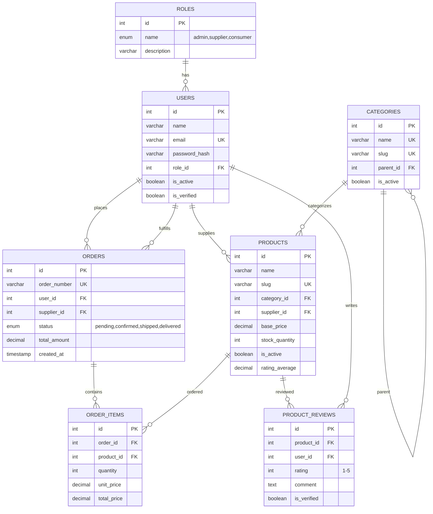
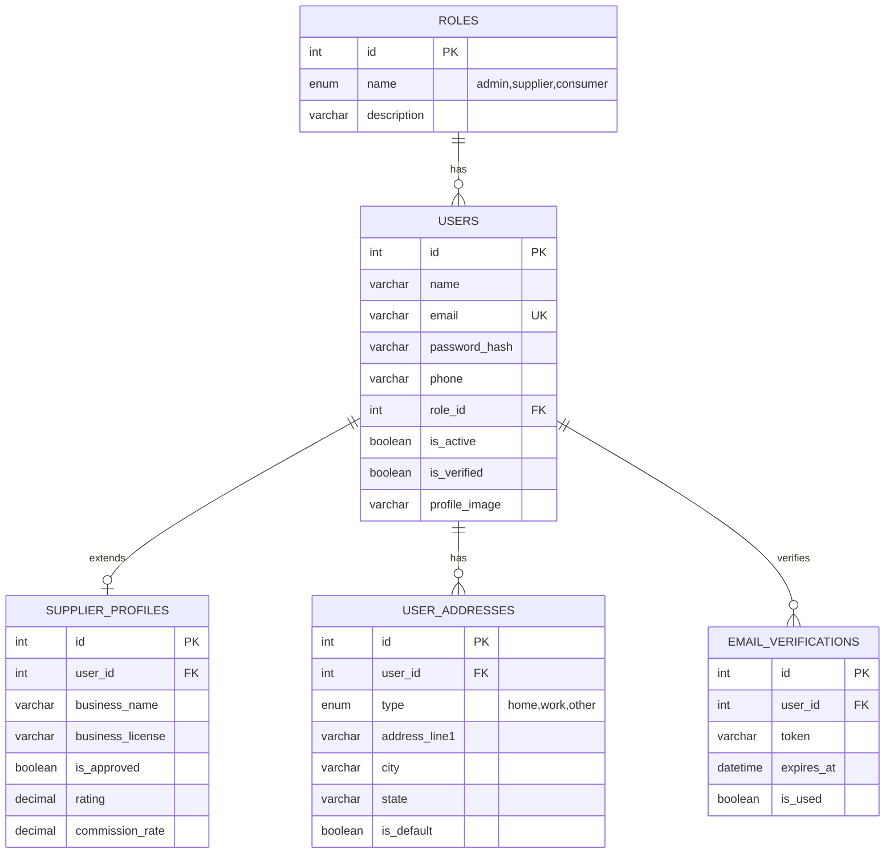
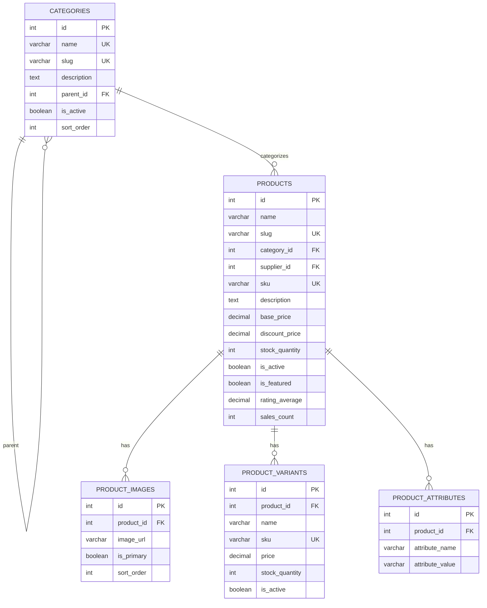
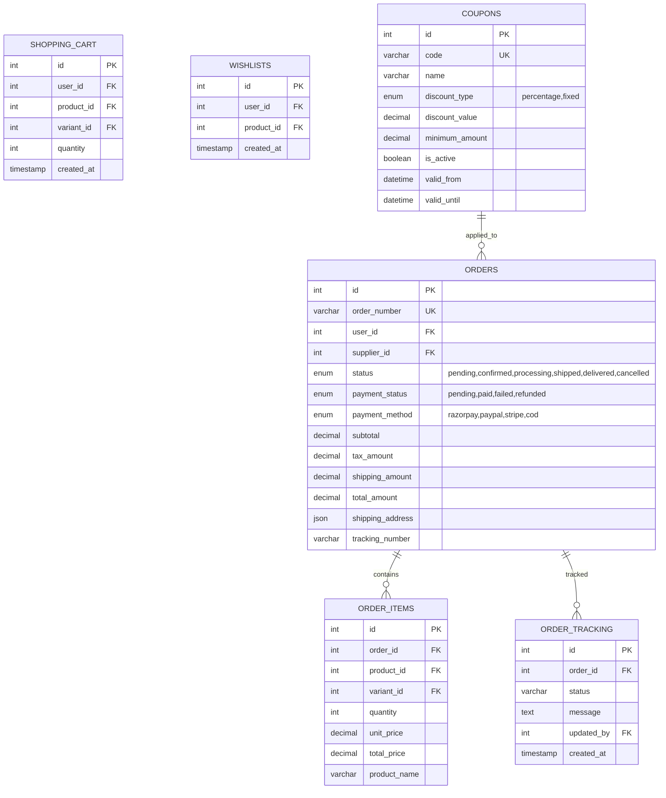
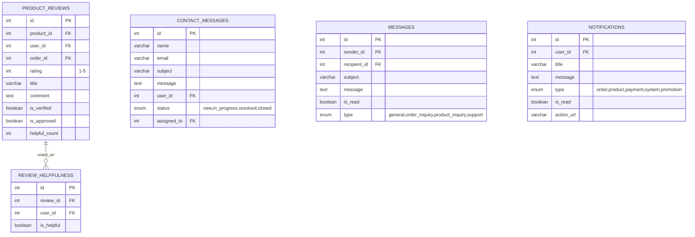
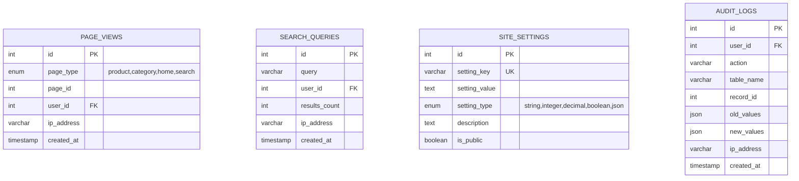

# 🗂️ MediPlant Database ER Diagram

## Entity Relationship Diagram - MediPlant E-Commerce Platform

### 🏗️ Core System Overview

---

### 👥 User Management Module

---

### 🛍️ Product Catalog Module

---

### 🛒 Shopping & Order Management

---

### ⭐ Reviews & Communication

---

### 📊 Analytics & System Management

---

## � Database Structure Summary

### 🎯 **Modular Design Benefits:**

✅ **Easy to Understand** - Each diagram focuses on specific functionality  
✅ **Clear Relationships** - Simplified connections between related tables  
✅ **Maintainable** - Updates can be made to individual modules  
✅ **Scalable** - New features can be added as separate modules  

### 📊 **Module Overview:**

| Module | Tables | Purpose |
|--------|--------|---------|
| **Core System** | 7 tables | Main entities and relationships |
| **User Management** | 5 tables | Authentication, profiles, addresses |
| **Product Catalog** | 5 tables | Products, categories, variants, images |
| **Shopping & Orders** | 6 tables | Cart, orders, payments, tracking |
| **Reviews & Communication** | 5 tables | Reviews, messages, notifications |
| **Analytics & System** | 4 tables | Analytics, settings, audit logs |

### 🔑 **Key Relationships:**

#### **Core Entity Relationships:**
- `USERS` ↔ `ROLES` (Many-to-One)
- `USERS` → `PRODUCTS` (One-to-Many) *[Supplier relationship]*
- `CATEGORIES` → `PRODUCTS` (One-to-Many)
- `PRODUCTS` → `PRODUCT_VARIANTS` (One-to-Many)
- `ORDERS` → `ORDER_ITEMS` (One-to-Many)

#### **Cross-Module Relationships:**
- `USERS` → `ORDERS` (Customer & Supplier relationships)
- `PRODUCTS` → `ORDER_ITEMS` (Product ordering)
- `USERS` → `PRODUCT_REVIEWS` (Review system)
- `ORDERS` → `PRODUCT_REVIEWS` (Verified purchases)

### 🏗️ **Database Design Principles:**

1. **📱 Modular Architecture** - Logical separation of concerns
2. **🔐 Security First** - Audit trails and user verification
3. **⚡ Performance Optimized** - Strategic indexing and denormalization
4. **🔄 Scalable Design** - Support for growth and new features
5. **🛡️ Data Integrity** - Foreign key constraints and validation

### � **Implementation Notes:**

- **Indexes**: Strategic indexes on frequently queried fields (user_id, product_id, order_id)
- **JSON Fields**: Flexible storage for addresses and audit data
- **Enums**: Constrained values for status fields and categories
- **Timestamps**: Comprehensive tracking of create/update times
- **Soft Deletes**: Use `is_active` flags instead of hard deletes where appropriate

### 🚀 **Development Workflow:**

1. Start with **Core System** module for basic functionality
2. Implement **User Management** for authentication
3. Build **Product Catalog** for inventory management
4. Add **Shopping & Orders** for e-commerce features
5. Integrate **Reviews & Communication** for user engagement
6. Deploy **Analytics & System** for monitoring and insights
